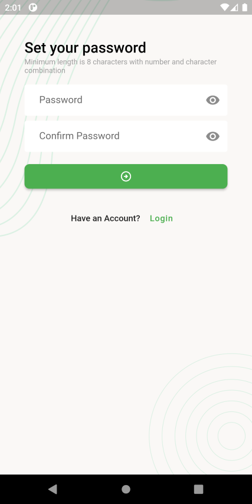
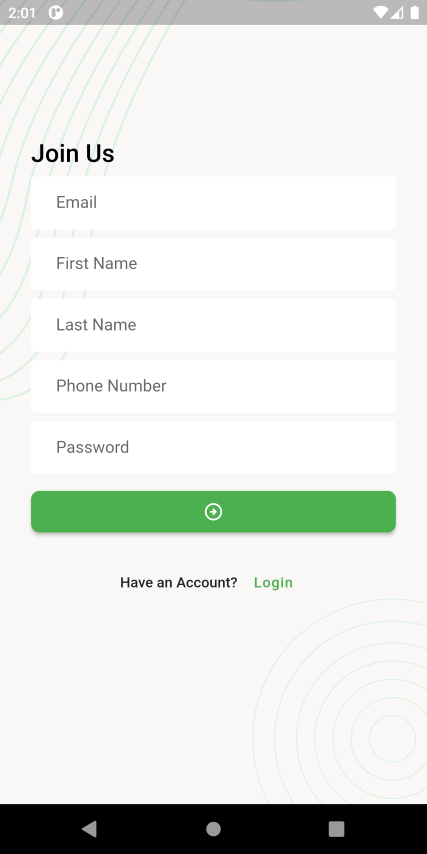
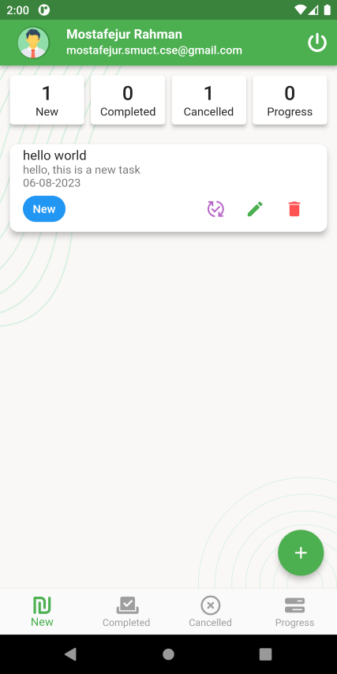
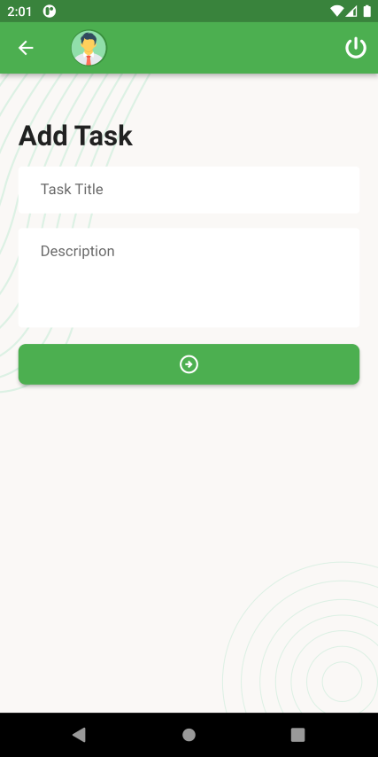
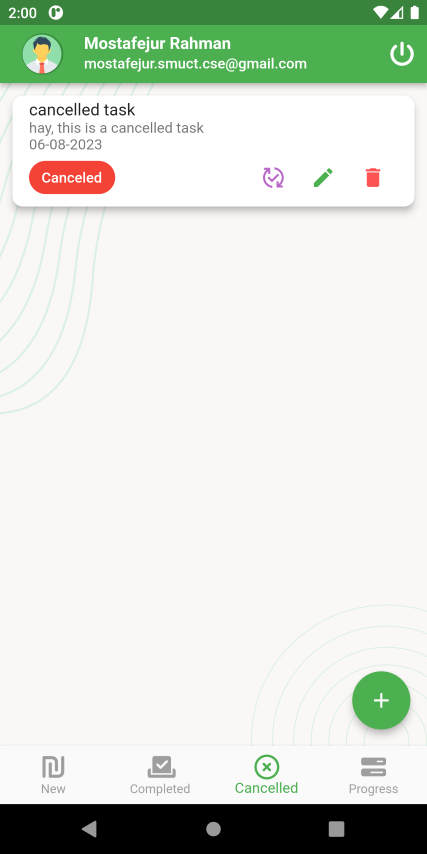
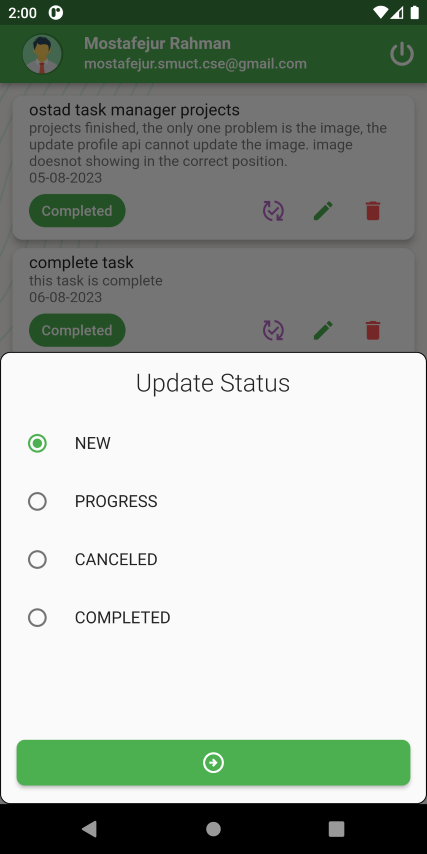

# Task_manager_flutter

A new Task Manager Flutter project.

**To get this apps, run this command in your terminal**

```bash
git clone https://github.com/mostafejur21/task-manager-flutter.git 
```

or

## Problems

here are some problems

- The update image is not showing in the appbar.
- Reset password is working also previous password is working.(There is some bugs in the api, **the Response is success and OTP is successfully get the email**)
- The Status count api is not working. **_So i have to use different method to get the status count. and its working fine._**

## _Here are some screenshot of the app_

Auth | table |
------------ | -------------
 | 
 | 
 | 
 | 
🗈 **_New task screen_** | 🗈 **_Add New task screen_**|
 |  
 **_Update Profile screen_**|**_Complete task screen_** |
 | 
 | 
**_status change Buttom sheet_** | **_log out warning popup_** |
 | 
