# Task_manager_flutter

A new Task Manager Flutter project.

**_In this Apps, i use fvm. flutter version 3.10.6. kindly check the fvm config file_**

To get this app, run this command in your terminal:

```bash
git clone https://github.com/mostafejur21/task-manager-flutter.git 
```

## Remember to run fvm command to get the flutter version 3.10.6

```bash
fvm use 3.10.6
flutter pub get
```

## Problems

here are some problems

- The update image is not showing in the appbar.
- Reset password is working also previous password is working.(There is some bugs in the api, **the
  Response is success and OTP is successfully get the email**)
- The Status count api is not working. *
  *_So i have to use different method to get the status count. and its working fine.__*

## _Here are some screenshot of the app_

 Auth                                                     | table                                                    |
----------------------------------------------------------|----------------------------------------------------------
  | 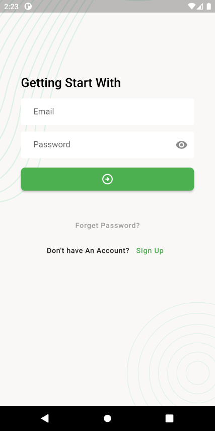
  | 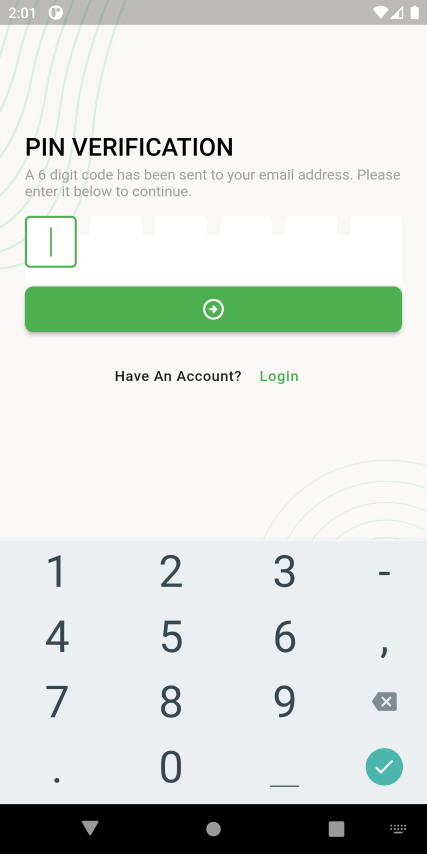
  | 
  | 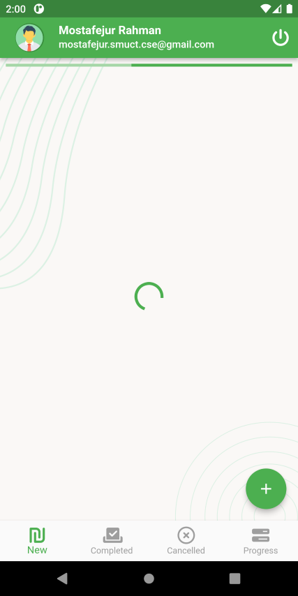
 🗈 **_New task screen_**                                 | 🗈 **_Add New task screen_**                             |
 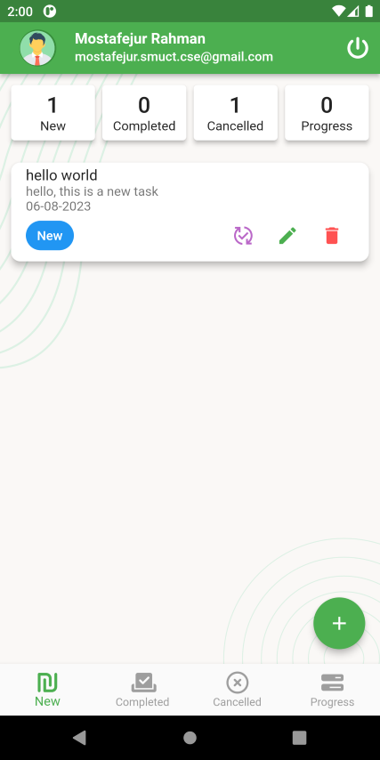 | 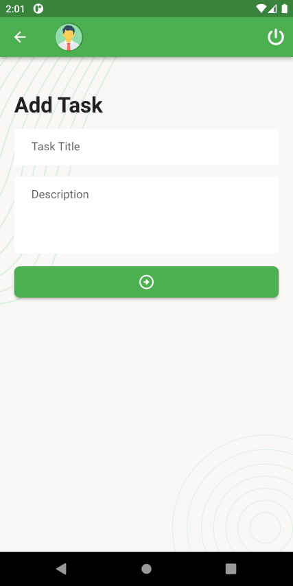
 **_Update Profile screen_**                              | **_Complete task screen_**                               |
 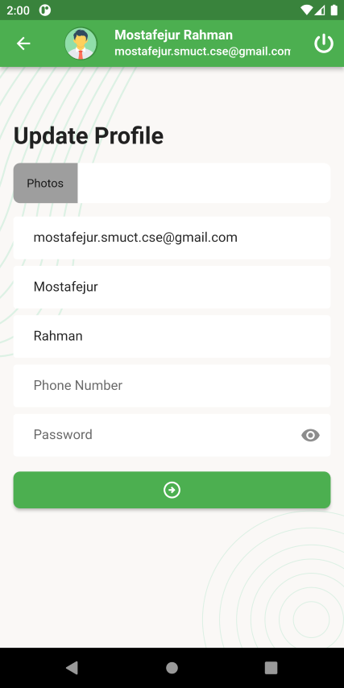 | 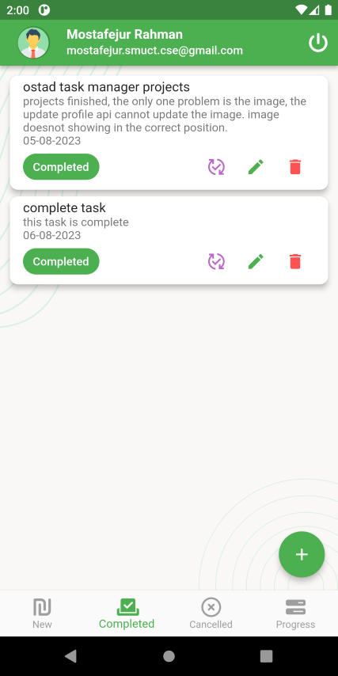
 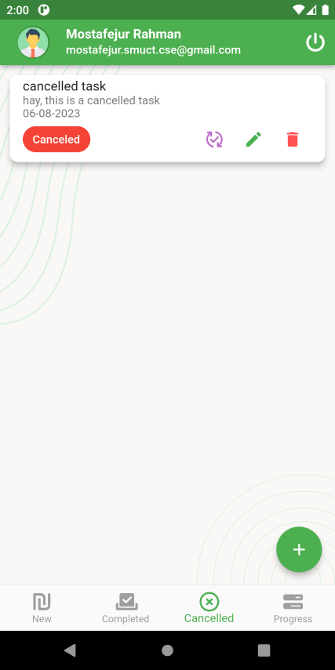 | 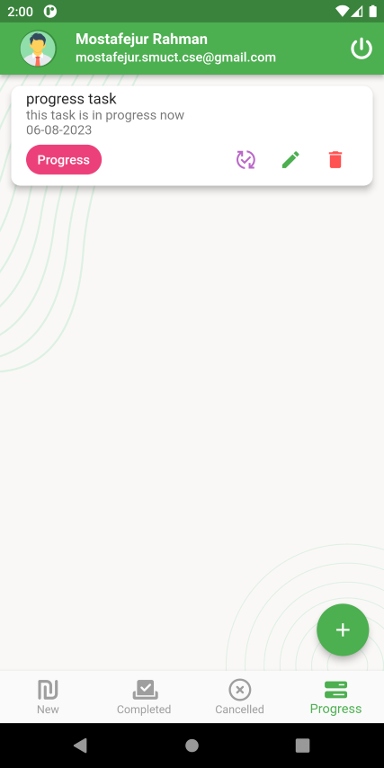
 **_status change Buttom sheet_**                         | **_log out warning popup_**                              |
 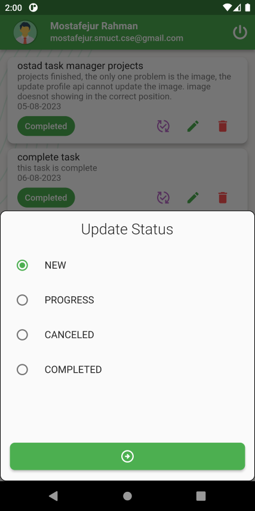 | 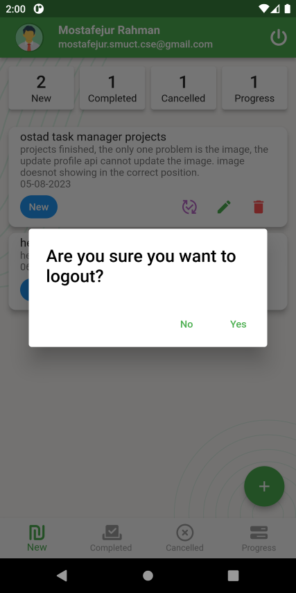


Task Manager Flutter - Guia de Configuração
Este guia vai ajudá-lo a configurar o ambiente de desenvolvimento para o projeto Task Manager Flutter, especialmente para a plataforma Windows. Inclui a solução de problemas comuns encontrados durante a configuração.

Pré-requisitos
Sistema Operacional: Windows 10 ou 11 (64-bit)

Git for Windows

Visual Studio 2022 com a carga de trabalho "Desktop development with C++"

Flutter SDK

Configuração Inicial do Ambiente
1. Instalação do Flutter SDK
Baixe o Flutter SDK do site oficial ou use o comando no VS Code: Flutter: New Project para instalar.

Extraia o arquivo zip para uma pasta sem espaços (ex: C:\src\flutter).

Adicione o caminho do Flutter ao seu PATH do sistema (ex: C:\src\flutter\bin).

2. Configuração do Visual Studio 2022
Instale o Visual Studio 2022 com a carga de trabalho "Desktop development with C++". Isso é necessário para compilar o código nativo do Windows.

3. Verificação do Ambiente
Abra o terminal e execute:

bash
flutter doctor
Este comando verificará se o ambiente está corretamente configurado. Corrija quaisquer problemas relatados.

Configuração do Projeto
1. Clonar o Repositório
Clone o repositório do projeto para uma pasta sem espaços no caminho (ex: C:\src\task_manager_flutter).

2. Adicionar Suporte ao Windows
Se o projeto não tiver suporte para Windows, execute no diretório do projeto:

bash
flutter create --platforms=windows .
3. Obter as Dependências
bash
flutter pub get
Solução de Problemas Comuns
Erro: Versão do SDK Dart Incompatível
Se você encontrar um erro como:

text
Because task_manager_flutter requires SDK version >=3.35.3 <4.0.0, version solving failed.
Siga estes passos:

Altere para o canal beta do Flutter e atualize:

bash
flutter channel beta
flutter upgrade
Verifique a versão do Flutter e Dart:

bash
flutter --version
Execute novamente:

bash
flutter pub get
Erro: Diretório do Plugin Não Encontrado (CMake Error)
Se você encontrar um erro de CMake relacionado a plugins (ex: file_selector_windows), execute:

bash
flutter clean
flutter pub get
Se o erro persistir, reinstale o plugin:

bash
flutter pub remove file_selector_windows
flutter pub add file_selector_windows
Erro: Android SDK com Espaços no Caminho
Se o flutter doctor reportar que o Android SDK está em um caminho com espaços:

Mova a pasta sdk para um caminho sem espaços (ex: C:\Android\Sdk).

Atualize a variável de ambiente ANDROID_SDK_ROOT para o novo caminho.

No Android Studio, atualize o "Android SDK Location" em File → Settings → Appearance & Behavior → System Settings → Android SDK.

Erro: Método 'UnmodifiableUint8ListView' Não Encontrado
Se você encontrar um erro relacionado ao pacote win32:

bash
flutter pub upgrade win32
flutter pub cache clean
flutter clean
flutter pub get
Executando o Projeto
Para executar o projeto no Windows:

bash
flutter run -d windows
Build de Release
Para construir uma versão de release para Windows:

bash
flutter build windows
O executável será gerado em build/windows/runner/Release/.

Distribuição
Para distribuir o aplicativo, você pode criar um pacote MSIX:

bash
flutter pub add msix
flutter pub run msix:create
Siga o guia oficial para mais detalhes.

Dicas Adicionais
Mantenha o Flutter atualizado executando flutter upgrade regularmente.

Use flutter pub outdated para verificar dependências desatualizadas.

Use flutter pub upgrade --major-versions para atualizar dependências para versões principais mais recentes.

Recursos Úteis
Documentação do Flutter para Windows

Gerenciamento de Dependências

Solução de Problemas de Build

Esperamos que este guia ajude a configurar o ambiente e resolver os problemas encontrados. Se ainda houver dificuldades, consulte a documentação oficial ou a comunidade Flutter.

Task Manager Flutter - Guia de Configuração
Este guia documenta todos os passos necessários para configurar o ambiente de desenvolvimento, resolver problemas comuns e executar o projeto Flutter para Windows.

Pré-requisitos
Windows 10 ou 11 (64-bit)

Git for Windows

Visual Studio 2022 com carga de trabalho "Desktop development with C++"

Flutter SDK

Configuração Inicial do Ambiente
1. Instalação do Flutter SDK
bash
# Baixe o Flutter SDK do site oficial ou use:
flutter channel stable
flutter upgrade
2. Verificação do Ambiente
bash
flutter doctor
3. Habilitar Suporte para Windows
bash
flutter config --enable-windows-desktop
Configuração do Projeto
1. Clonar/Criar Projeto
bash
# Para criar novo projeto com suporte Windows:
flutter create --platforms=windows meu_projeto

# OU para adicionar suporte Windows a projeto existente:
flutter create --platforms=windows .
2. Obter Dependências
bash
flutter pub get
Solução de Problemas Comuns
Erro de Versão do SDK Dart
bash
# Mudar para canal beta e atualizar
flutter channel beta
flutter upgrade

# Verificar versões
flutter --version
dart --version

# Limpar cache e recarregar dependências
flutter clean
flutter pub get
Erro de Plugins e CMake
bash
# Limpar e recarregar dependências
flutter clean
flutter pub get

# Reinstalar plugin específico (ex: file_selector_windows)
flutter pub remove file_selector_windows
flutter pub add file_selector_windows
Erro de Android SDK com Espaços
bash
# Mover Android SDK para caminho sem espaços
move "C:\Users\Washington climaco\AppData\Local\Android\sdk" C:\Android\Sdk

# Configurar Flutter para novo caminho
flutter config --android-sdk C:\Android\Sdk
Erro de Método Não Encontrado (UnmodifiableUint8ListView)
bash
# Atualizar pacote win32
flutter pub upgrade win32

# Limpar cache completo
flutter pub cache clean
flutter clean
flutter pub get
Executando o Projeto
Desenvolvimento
bash
# Executar no Windows
flutter run -d windows

# Build para release
flutter build windows
Verificação Contínua
bash
# Verificar dispositivos disponíveis
flutter devices

# Verificar dependências desatualizadas
flutter pub outdated

# Analisar código
flutter analyze
Estrutura do Projeto
text
task_manager_flutter/
├── android/          # Configurações Android
├── ios/              # Configurações iOS
├── windows/          # Configurações Windows
├── lib/              # Código Dart principal
│   └── main.dart     # Ponto de entrada
├── assets/           # Recursos (imagens, fonts, etc.)
└── pubspec.yaml      # Dependências e configurações
Dicas Adicionais
Mantenha o Flutter atualizado: Execute flutter upgrade regularmente

Use caminhos sem espaços: Evite diretórios com espaços no nome

Verifique o flutter doctor regularmente para garantir que o ambiente está configurado corretamente

Para problemas persistentes: Execute flutter build windows -v para logs detalhados

Recursos Úteis
Documentação oficial do Flutter

Suporte para Desktop no Flutter

Gerenciamento de dependências

Este guia cobre os principais comandos e soluções para os problemas mais comuns encontrados durante o desenvolvimento Flutter para Windows. 